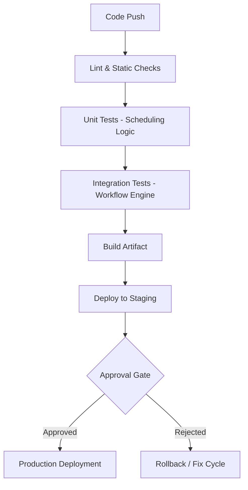

# CI/CD Pipeline — Scheduling System

## 🧠 Purpose

Defines deployment and automation strategy for validating and shipping changes safely in a workflow orchestration system.

---

## 🔄 Pipeline Flow

---

## 🧪 Testing Strategy

### Unit Tests
- Conflict detection logic
- Time validation rules
- Resource allocation decisions

### Integration Tests
- Full workflow execution simulation
- Multi-request scheduling scenarios
- Concurrent booking attempts

---

## 🚀 Deployment Strategy

- Blue/Green deployment (recommended)
- Versioned workflow logic
- Rollback capability for scheduling rules

---

## ⚙️ Key Principles

- No deployment of unvalidated scheduling logic
- Deterministic behavior across environments
- Safe rollout of workflow rule changes
