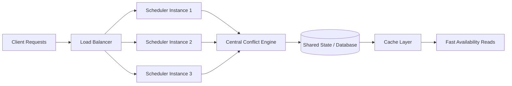

# Scaling Strategy — Scheduling System

## 🧠 Purpose

Defines how the scheduling system handles growth in users, requests, and resource complexity.

---

---

## ⚙️ Scaling Model

### Horizontal Scaling
- Multiple instances of scheduling orchestrator
- Stateless request processing layer

### Bottleneck Control
- Centralized conflict detection must remain consistent
- Shared state requires controlled access layer

---

## 📊 Load Considerations

System must handle:
- Concurrent booking requests
- High-frequency schedule queries
- Peak-time resource contention

---

## 🧩 Scaling Challenges

- Maintaining consistency under concurrent writes
- Preventing race conditions in booking allocation
- Ensuring conflict detection remains accurate at scale

---

## 🚀 Scaling Strategy

- Decouple input layer from scheduling logic
- Cache read-heavy availability queries
- Centralize write operations for consistency
